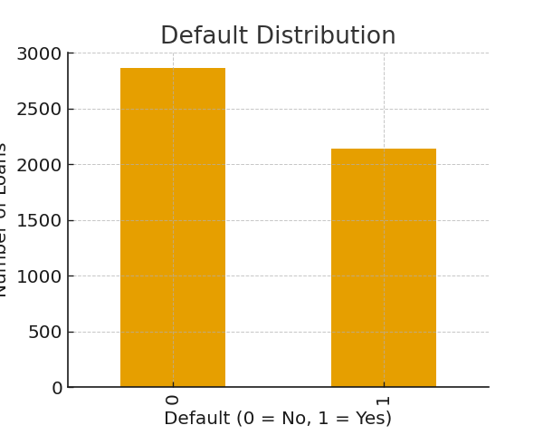
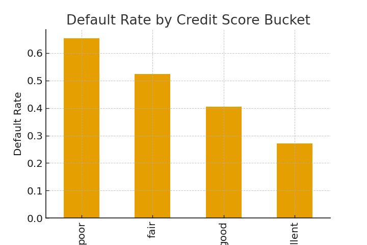

# Credit Risk Analysis – Loan Default Prediction 💳📉

**Author:** Luis Chaumer  
**Role:** Data Analyst  
**Tools:** Python, SQL (SQLite), Pandas, NumPy, Scikit-learn, Matplotlib  

---

## 📘 Project Overview

This project focuses on **credit risk analysis and loan default prediction** for a fictional consumer lending portfolio.  
Using a synthetic dataset of **5,000 loans**, the goal is to identify key risk drivers, build baseline ML models, and evaluate borrower creditworthiness through data-driven insights.

This analysis simulates how fintechs, banks, and lending institutions evaluate risk and manage portfolios.

---

## 🎯 Project Objectives

- Analyze borrower characteristics and credit behavior  
- Identify drivers that contribute most to **loan default**  
- Build predictive models using:
  - **Logistic Regression**
  - **Random Forest Classifier**
- Create **risk tiers** using predicted PD (probability of default)  
- Combine **Python + SQL** to replicate real credit risk workflows  
- Provide business recommendations to improve lending policies  

---

## 📊 Dataset Description

The dataset includes 5,000 synthetic loan applications with:

| Feature | Description |
|--------|-------------|
| `client_id` | Unique identifier |
| `application_date` | Loan application timestamp |
| `age` | Borrower age |
| `annual_income` | Yearly income |
| `loan_amount` | Amount requested |
| `term_months` | Loan term (12–60 months) |
| `interest_rate` | Applied interest rate |
| `loan_purpose` | Purpose of loan |
| `employment_status` | Employment situation |
| `credit_score` | Synthetic FICO-like score |
| `dti` | Debt-to-income ratio |
| `default` | Target variable (0 = no default, 1 = default) |

This dataset was designed to simulate realistic risk behavior (e.g., higher default rates for low credit scores, high DTI, and certain loan purposes).

---

## 🔍 Exploratory Data Analysis (EDA)

### **Default Distribution**

### **Default Rate by Credit Score Bucket**

Key EDA findings:
- Low credit score segments exhibit significantly higher default rates.  
- Small business and debt consolidation loans show elevated risk.  
- Income and employment status strongly influence creditworthiness.

---

## 🗄 SQL Portfolio Analysis

SQL is widely used in credit risk monitoring.  
Using **SQLite**, the dataset was loaded into an in-memory database to query risk segments.

### 🔹 Default rate by loan purpose (SQL)

SELECT loan_purpose,
       COUNT(*) AS total_loans,
       ROUND(AVG(default), 4) AS default_rate
FROM loans
GROUP BY loan_purpose
ORDER BY default_rate DESC;
🔹 Risk segmentation by credit and income buckets
🔹 Portfolio metrics by year
This demonstrates how SQL complements Python in daily portfolio analytics.

🤖 Machine Learning Models
Two predictive models were built:

1. Logistic Regression (baseline)
Interpretable model

Good for understanding linear effects

Baseline AUC used as benchmark

2. Random Forest (improved model)
Captures non-linear interactions

Provides feature importance

Higher AUC than Logistic Regression

ROC Curves

⭐ Feature Importance (Random Forest)

Key drivers of loan default:

Credit score

DTI (Debt-to-Income Ratio)

Interest rate

Loan amount

These align with real-world credit risk principles.

🧩 Risk Segmentation
Borrowers were segmented into tiers based on predicted PD:

Risk Tier	PD Range
Very Low	0–10%
Low	10–25%
Medium	25–50%
High	50–100%

These tiers can be used for:

Pricing

Credit limits

Approvals

Early collections strategies

🚀 Business Recommendations
Tighten lending criteria for risky segments (low credit score + high DTI + high loan amounts).

Implement risk-based pricing to compensate for higher expected losses.

Expand monitoring and early collections for medium/high risk tiers.

Improve loan policies for small business and debt consolidation categories.

Integrate SQL dashboards for weekly portfolio risk tracking.

🧰 Tech Stack
Python: Pandas, NumPy, Scikit-Learn, Matplotlib, Seaborn

SQL: SQLite (in-memory database)

Jupyter Notebook

Machine Learning: Logistic Regression, Random Forest

📁 Repository Structure
powershell
Copiar código
credit-risk-analysis/
├── data/
│   └── credit_risk_dataset.csv
├── notebooks/
│   └── credit_risk_analysis.ipynb
├── images/
│   ├── default_distribution.png
│   ├── default_rate_by_credit.png
│   ├── roc_curves.png
│   └── feature_importance.png
└── README.md
📬 Contact
If you want to discuss this project:

Luis Chaumer
Data Analyst
📩 Email: luischaumer@gmail.com
🔗 LinkedIn: www.linkedin.com/in/luis-chaumer123

